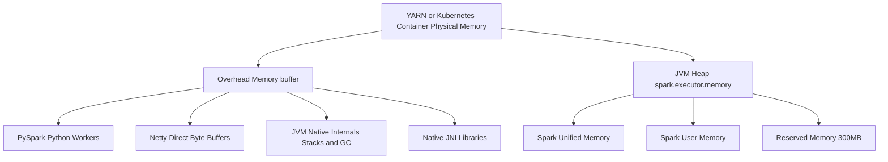
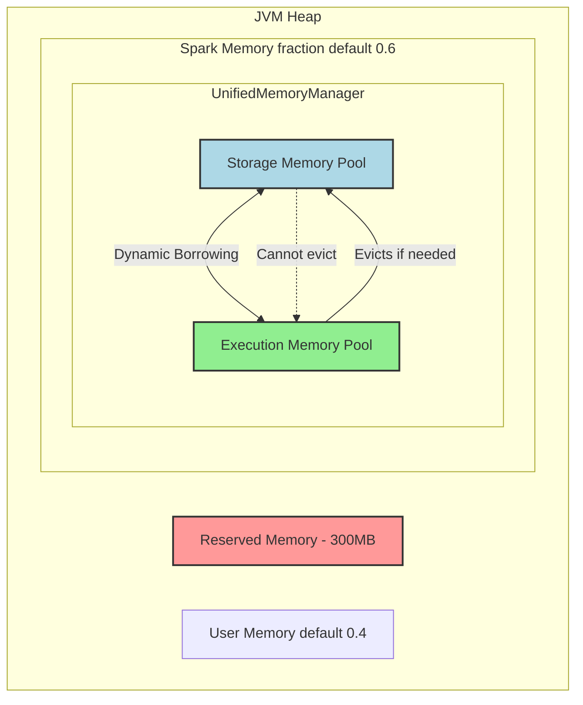
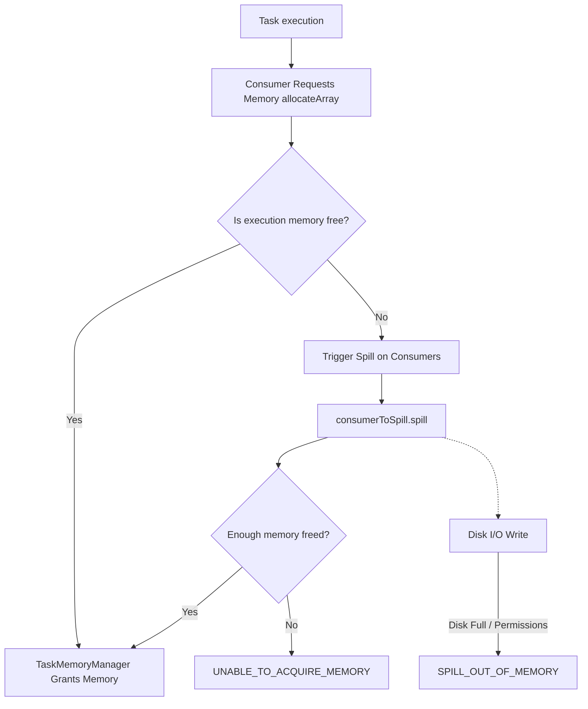

# Apache Spark Memory Architecture: A Staff-Level Deep Dive

This document provides a comprehensive, top-down exploration of Apache Spark's memory architecture. It maps the flow of memory from the physical limits of the cluster manager's container down to the byte-level layout of Project Tungsten's `UnsafeRow`. 

---

## 1. The Physical Container: Overhead vs Heap

When Spark requests an executor, the cluster manager (YARN, Kubernetes) provisions a physical container. The requested JVM Heap (`spark.executor.memory`) is only a subset of this container.

Spark requests an additional buffer called **Overhead Memory**, calculated by default as:
`max(384 MB, 10% of spark.executor.memory)`

### Architecture & Memory Breakdown



### The `OOMKilled` (Exit Code 137) Phenomenon
If the JVM Heap runs out of space, Spark throws a catchable `java.lang.OutOfMemoryError`. 
However, if **Overhead Memory** runs out of space (e.g., due to heavy PySpark execution or massive Netty network buffers), the Operating System abruptly terminates the container with `SIGKILL` (Exit Code 137). There is no stack trace.

---

## 2. The JVM Heap: Unified Memory Manager

Inside the JVM Heap, Spark uses the `UnifiedMemoryManager` to enforce a **soft boundary** between execution memory (used for shuffles, joins, sorts) and storage memory (used for caching RDDs and broadcast variables).



### Execution Fairness
When multiple tasks run concurrently, the `ExecutionMemoryPool` prevents starvation by ensuring a `1/2N` to `1/N` guarantee:
- A task can acquire up to `1 / N` of the total execution memory.
- A task is guaranteed at least `1 / 2N` of the pool before it is forced to spill to disk.

---

## 3. The "Wild West": User Memory & Unmanaged Tracking

The 40% of the JVM Heap that Spark does not allocate to the `UnifiedMemoryManager` is known as **User Memory**.

### The Danger of User Memory
User memory holds objects created by your custom code (e.g., UDFs, `mapPartitions` buffers) and third-party libraries. Because Spark's memory manager does not track this space, **it cannot spill it to disk**. If your UDF buffers a massive HashMap that exceeds User Memory, the JVM crashes instantly.

### Staff-Level Insight: Unmanaged Memory Tracking
In modern Spark versions, internal components that manage their own memory (like RocksDB state stores) register as `UnmanagedMemoryConsumer`. A background thread polls these consumers to track their size. 

If User/Native memory balloons, `UnifiedMemoryManager` dynamically throttles the `ExecutionMemoryPool`, forcing tasks to spill earlier to prevent a JVM crash:
```scala
// UnifiedMemoryManager dynamically protects the JVM
def computeMaxExecutionPoolSize(): Long = {
  val unmanagedMemory = getUnmanagedMemoryUsed(memoryMode)
  val availableMemory = maxMemory - math.min(storagePool.memoryUsed, storageRegionSize)
  math.max(0L, availableMemory - unmanagedMemory)
}
```

---

## 4. Bypassing the JVM: Off-Heap & Zero-Copy

To survive massive scale, Spark uses techniques to bypass the JVM heap entirely.

### Off-Heap Memory (Tungsten)
By setting `spark.memory.offHeap.enabled=true`, Spark uses `sun.misc.Unsafe` to allocate raw C `malloc()` memory from the OS. 
- **Benefit:** Zero Garbage Collection pauses. 
- **Sizing:** `spark.memory.offHeap.size` is added *on top* of the container request (it does not cannibalize Overhead Memory).

### Zero-Copy Shuffling
For network transfers, Spark uses Java NIO `DirectByteBuffer`. Instead of copying data from disk into the JVM Heap (which costs CPU and causes GC), Spark tells the OS to use Direct Memory Access (DMA) to copy data directly from disk to the network socket. 
- **The Catch:** The tiny `DirectByteBuffer` pointer objects live on the JVM Heap, but the massive native buffers they point to consume **Overhead Memory**.

---

## 5. Bare Metal Performance: The `UnsafeRow` Format

When data is stored in Tungsten (Off-Heap or On-Heap), it is formatted as an `UnsafeRow`. This eliminates Java object serialization overhead and ensures CPU cache alignment.

| Byte Offset | Size | Purpose | Example Content (`123`, `"Spark"`, `30`) |
| :--- | :--- | :--- | :--- |
| `0 - 7` | 8 bytes | **Null Bit Set** | `00000000...` *(1 bit per field to track nulls)* |
| `8 - 15` | 8 bytes | **Fixed Field 1** | `123` *(Primitive Int)* |
| `16 - 23` | 8 bytes | **Fixed Field 2** | `[Offset: 32] [Length: 5]` *(Pointer to variable string)* |
| `24 - 31` | 8 bytes | **Fixed Field 3** | `30` *(Primitive Int)* |
| `32 - 36` | 5 bytes | **Variable Data** | `"Spark"` *(Raw UTF-8 bytes)* |

**Zero Deserialization:** Spark's query engine generates Java bytecode that reads directly from these raw memory addresses using bitwise hardware comparisons, bypassing object creation entirely.

---

## 6. Anatomy of Spark OOMs

Why does Spark crash if it is designed to spill to disk? 

Every memory-intensive operator (like sorting) implements the `MemoryConsumer` interface. If memory runs low, Spark loops through consumers and calls `spill()`. 



### The Root Causes of Failure
1. **`SPILL_OUT_OF_MEMORY`**: The consumer attempted to spill, but the local disk (`spark.local.dir`) was full or the OS rejected the IO write.
2. **`UNABLE_TO_ACQUIRE_MEMORY`**: The consumer required a contiguous block of memory (e.g., for a sorting pointer array) that could not be spilled. 
3. **The JVM Fragmentation Limit**: Because Spark allocates ON-HEAP pages using standard Java arrays (`new long[size]`), the JVM GC must find a physically contiguous gap in the heap. If the heap is fragmented and the GC cannot compact it (or if the array violates G1GC's Humongous Object limits), the JVM throws an OOM, causing the consumer to fail.
